# Getting Started with `git`

This guide will get you started with `git` repositories using a `git` client of your choice. You may be wondering why this isn't grouped with the [Installing Required Programs](./01_required_programs.md) guide, but it just got too long because of the choices in here.

This guide will walk you through the basic functionality of `git`, and by the end of it you will end up creating a pull request to add your name and a level for yourself to the repo.

<!-- omit from toc -->
## Contents

- [Installing a `git` Client](#installing-a-git-client)
- [Create a GitHub Account](#create-a-github-account)
- [Cloning This Repo](#cloning-this-repo)
- [Checking out the `dev` branch](#checking-out-the-dev-branch)
  - [Checking Out the `dev` Branch with `git`](#checking-out-the-dev-branch-with-git)
  - [Checking Out the `dev` Branch with GitHub Desktop](#checking-out-the-dev-branch-with-github-desktop)
  - [Checking Out the `dev` Branch with VSCode](#checking-out-the-dev-branch-with-vscode)
- [Creating a Feature Branch](#creating-a-feature-branch)
  - [Creating a Feature Branch with `git`](#creating-a-feature-branch-with-git)
  - [Creating a Feature Branch with GitHub Desktop](#creating-a-feature-branch-with-github-desktop)
  - [Creating a Feature Branch with VSCode](#creating-a-feature-branch-with-vscode)
- [Push a New Branch](#push-a-new-branch)
  - [Push a New Branch with `git`](#push-a-new-branch-with-git)
  - [Push a New Branch with GitHub Desktop](#push-a-new-branch-with-github-desktop)
  - [Push a New Branch with VSCode](#push-a-new-branch-with-vscode)
- [Making a Code Change](#making-a-code-change)
- [Staging a Change](#staging-a-change)
  - [Staging a Change with `git`](#staging-a-change-with-git)
  - [Staging a Change with GitHub Desktop](#staging-a-change-with-github-desktop)
  - [Staging a Change with VSCode](#staging-a-change-with-vscode)
- [Committing a Change](#committing-a-change)
  - [Committing a Change with `git`](#committing-a-change-with-git)
    - [Changing `git`'s Default Text Editor](#changing-gits-default-text-editor)
  - [Committing a Change with GitHub Desktop](#committing-a-change-with-github-desktop)
  - [Commiting a Change with VSCode](#commiting-a-change-with-vscode)

## Installing a `git` Client

If you haven't got a git client yet, please see the [Installing git](./01_required_programs.md#installing-git) section of the required programs guide.

As mentioned in the [Installing git](./01_required_programs.md#installing-git) section, each step will be broken down by git client. Just skip straight to the one you have chosen within this document too.

## Create a GitHub Account

Strictly this isn't necessary if you just want to run the game locally, and try out a few things. But if you plan to contribute, you may as well get an account set up now because you'll need it! Plus, how are you going to star this repo without a GitHub account? 😁

Creating an account is free, just head to [GitHub's signup page](https://github.com/signup) and follow the instructions.

This can then be used to sign into VSCode, GitHub Desktop, or other `git` clients.

## Cloning This Repo

Cloning the repo was covered in the [Installing Required Programs](./01_required_programs.md) guide. This may seem counter-intuative, but some of the config files within the repo were required when installing programs. To avoid repeating documentation (and give us a shot at actually maintaining the documentation), go and look at the [Cloning This Repo](./01_required_programs.md#cloning-this-repo) section, then come back and continue with this guide.

## Checking out the `dev` branch

In `git`, branches are a way of separating different features or different people's work. It allows multiple features or multiple people to work on their own code in isolation, before "merging" them together once complete. Within your own branch, use it as a way to "save" your work. Commit little and often, to ensure you never lose any work or unintentionally delete hours of work.

Within this repo, the `dev` branch contains completed but new features or work. It can then be tested and checked before being merged into `main`, which contains the code that will be ready for use. `dev` and `main` should both always be kept in a working state, to ease development pains, but `main` will be put under much more scrutiny.

To get started with your first changes, we need to "check out" the `dev` branch, for your work to be based off. You should always create feature branches off of `dev`, not `main`.

### Checking Out the `dev` Branch with `git`

1. Navigate to the `pebble_protectors` folder in a terminal.
2. Run `git checkout dev`.

### Checking Out the `dev` Branch with GitHub Desktop

1. Open the local repo in GitHub desktop.
2. Click the button that says "Current Branch".
3. Click on the `dev` branch:  
   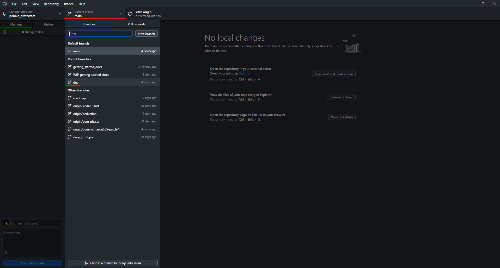

### Checking Out the `dev` Branch with VSCode

1. Open the local repo in VSCode.
2. Click the "Source Control" button on the sidebar, then the three dots, then "Checkout To":  
   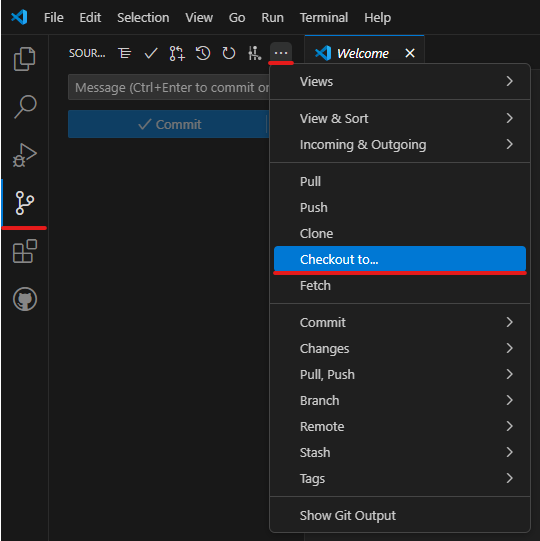
3. Select the `dev` branch (The commit ID next to `dev` will be different - this is OK!):  
   

## Creating a Feature Branch

To contribute code to the repo, it is best to create your own "branch" to work in. [Checking out the `dev` branch](#checking-out-the-dev-branch) was important, since the new branch is now based on the work within `dev`.

For your first contribution, a good branch name would be something like `[initials]_new_scene`, i.e. `ns_new_scene`. Although anything sensible is fine.

### Creating a Feature Branch with `git`

1. From a terminal within the repo, type `git branch branch_name`. For example, `git branch ns_new_scene`.
2. You will then need to "check out" your new branch. To do this, type `git checkout branch_name`. For example, `git checkout ns_new_scene`.

### Creating a Feature Branch with GitHub Desktop

1. Click the "branch" button, and then click "New Branch":  
   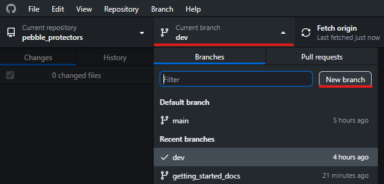
2. Enter the name of your new branch, and ensure that you have clicked "Create branch based on... dev":  
   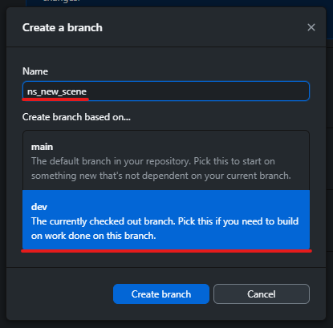

The created branch will be automatically checked out for you.

### Creating a Feature Branch with VSCode

1. Click the "Source Control" icon, the the three dots, then "Create Branch":  
   
2. Enter a name for the branch and click enter:  
   

The created branch will be automatically checked out.

## Push a New Branch

Currently, the new branch only exists on your local machine. You can commit changes to it fine, but they will not be accessible to others, and more importantly will not be backed up online! To mirror the new branch onto the "origin" (which in this case is the GitHub repository), we need to tell `git` what the origin for the current branch is, and then "push" our new branch to the origin.

### Push a New Branch with `git`

If you frequently will be creating branches you wish to push to GitHub, it may be worth setting a config option to automatically set up the remote when you create a new branch. This config can either be set for the current repo:

```PowerShell
git config push.autoSetupRemote true
```

Or alternativelty set as a global option:

```PowerShell
git config --global push.autoSetupRemote true
```

If you don't wish to do this, you can manually set the origin for the new branch with the following (replacing `ns_new_scene` with your branch name):

```PowerShell
git push -u origin ns_new_scene
```

After doing either approach, you should now be able to run `git push`.

### Push a New Branch with GitHub Desktop

Using GitHub Desktop, the branch should automatically have its origin set for you. Simply click the "Publish Branch" button:  


### Push a New Branch with VSCode

As with [GitHub Desktop](#push-a-new-branch-with-github-desktop), VSCode should automatically set up the branch origin for you. Simply click "Publish Branch" in the source control tab:  
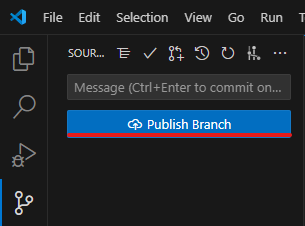

## Making a Code Change

*TODO*

## Staging a Change

With `git`, changes that you make (or newly added files) are just stored on your local machine, and `git` won't interact with them or [commit](#committing-a-change) them. In preparation for a [commit](#committing-a-change), you need to "stage" the changes you wish to commit to tell `git` what to include in the commit.

It is also important to note that `git` will not "track" files automatically when they are newly added to the repo. They must be "staged" and "committed" at least once before they are tracked by `git`.

After [Making a Code Change](#making-a-code-change), we now need to "stage" what we changed in preparation to [commit](#committing-a-change) it.

### Staging a Change with `git`

Once you've made a change, running `git status` should show you what has changed within the repo:

```PowerShell
> git status
On branch ns_new_scene
Your branch is ahead of 'origin/ns_new_scene' by 1 commit.
  (use "git push" to publish your local commits)

Changes not staged for commit:
  (use "git add <file>..." to update what will be committed)
  (use "git restore <file>..." to discard changes in working directory)
        modified:   docs/my_changed_file.md

Untracked files:
  (use "git add <file>..." to include in what will be committed)
        docs/my_new_file.md

no changes added to commit (use "git add" and/or "git commit -a")
```

Here you can see the `docs/my_changed_file.md` has been modified. This file has already been comitted once, so is "tracked" by `git`.

The file `docs/my_new_file.md` is new to the repo, and is currently "untracked".

Both "tracked" and "untracked" files can be "staged" for a commit in the same manner; by using the `git add <file>` command. To stage a single file, run `git add docs/my_new_file.md` for example. To stage all files, run `git add .`.

Try staging all of your changes in preparation for a commit with `git add .`.

You should now see that the files are "staged" if you run `git status` again:

```PowerShell
> git status
On branch ns_new_scene
Your branch is ahead of 'origin/ns_new_scene' by 1 commit.
  (use "git push" to publish your local commits)

Changes to be committed:
  (use "git restore --staged <file>..." to unstage)
        modified:   docs/my_changed_file.md
        new file:   docs/my_new_file.md
```

Helpfully, `git` also tells you how to unstage files here. Simply run `git restore --staged <file>`. This will not delete the file! It will simply tell git that you don't actually want to include it in the staging area. It will go back to being "unstaged".

It is worth noting here, that the "Changes to be committed" are "frozen" at the point you staged those files. If you change the files again now, it will be treated as an "unstaged change":

```PowerShell
> git status
On branch ns_new_scene
Your branch is ahead of 'origin/ns_new_scene' by 1 commit.
  (use "git push" to publish your local commits)

Changes to be committed:
  (use "git restore --staged <file>..." to unstage)
        modified:   docs/my_changed_file.md
        new file:   docs/my_new_file.md

Changes not staged for commit:
  (use "git add <file>..." to update what will be committed)
  (use "git restore <file>..." to discard changes in working directory)
        modified:   docs/my_changed_file.md
```

The additional change can be staged like before, or left for a future commit.

### Staging a Change with GitHub Desktop

When you edit files in the repo, you will notice that GitHub Desktop will start showing them under the "Changes" tab. In GitHub Desktop files are staged by default, noted by the tickbox next to the file:  
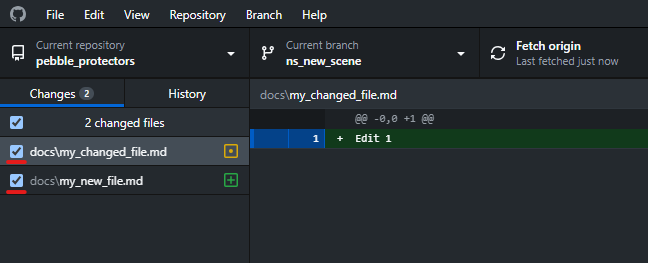

If you wish to unstage something, simply untick the box next to the file.

For more advanced cases, you may wish to stage part of a file in one commit, and leave the rest for future commits. In GitHub Desktop, you can do this by clicking the file you wish to stage a section of in the "Changes" tab, and then clicking at the start of the line to stage / unstage the individual line:  


Highlighting the line indicates it is staged, if it is not highlighted then it is unstaged. In this example Edit 1 and Edit 3 are staged, but Edit 2 is unstaged.

### Staging a Change with VSCode

In the "Source Control" tab of VSCode, changes will begin to appear as files are edited. They can be staged by clicking th `+` symbol when hovering over them:  
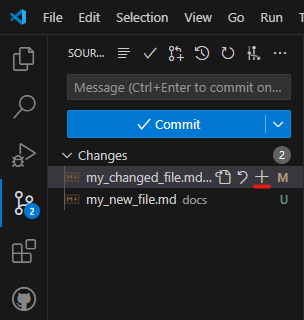

When the change is staged, it will appear under a new "Staged Changes" heading:  


With lots of changes, this view can get cluttered and it can be hard to keep track of where files are located. To help with this, I recommend changing to the "tree view" within the source control tab:  
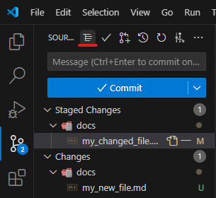

To stage a section of a file, double click the file in the "Source Control" tab and you will be presented with a diff view. To stage a single or selection of lines, highlight it, right click, and then click "Stage Selected Ranges":  


You can do this multiple times within a file, and highlight multiple lines at a time. This will add only the selected sections of the file to the staging area, ready for comitting:  


If you would like to stage an entire block of code, you can do so from the same view (after clicking a file in the source control tab) by clicking the "stage block" button between the two split windows:  


## Committing a Change

In `git`, a "commit" is a record of the changes made to one or more file(s) with a description explaining what the change was for. An example of a commit message would be something like this:

```PowerShell
commit 6bc0ffe0cd1056ae992f4fa0a8782f0844248140
Author: Nathaniel Struselis <nathaniel.struselis@hotmail.co.uk>
Date:   Tue May 14 07:30:40 2024 +0100

    Added WIP git_good guide and relevant images.

    This is not yet finished (far from it!), but so far details
    - Creating a GitHub account
    - Checking out the `dev` branch
    - Creating a new feature branch
    - Pushing a new branch
    - Making a code change [Not started]
    - Committing a change with `git` **[WIP]**
```

You can [view this commit on GitHub](https://github.com/NathanielJS1541/pebble_protectors/commit/6bc0ffe0cd1056ae992f4fa0a8782f0844248140), if you wish.

The commit ID (`6bc0ffe0cd1056ae992f4fa0a8782f0844248140`, or `6bc0ffe` for short) is a unique identifier for this particular commit in this repo.

The author is the name and email of the person that authored the commit (created it locally). This can (very occasionally) be different to the committer if the commit has been cherry-picked or rebased.

The date is simply the date at which the commit was authored.

The text following the date is the commit message. The first line of the commit message, `Added WIP git_good guide and relevant images.`, will be shown as the "title" or "preview" for the commit on GitHub, and should contain enough information to understand what the commit is trying to achieve. The rest of the commit message (which can be much longer than a single line) contains additional detail that may be helpful to reviewers, or people looking at the commit later. Think of the first line as a title, and any following lines as the description.

When creating your own commits, try and leave descriptive but concise commit messages with additional descriptions on the line below if necessary. The commit message `changed some things` isn't helping anyone!

Now we've gone over the basics of staging and what a commit is, let's try it out by committing the changes from the [Making a Code Change](#making-a-code-change) section to the branch created in the [Creating a Feature Branch](#creating-a-feature-branch) section. Stage all of the changes you've made as described in the [Staging a Change](#staging-a-change) section for your chosen `git` tool.

### Committing a Change with `git`

To commit the changes with `git` you can either run `git commit` to open a text editor to enter the commit message in:  
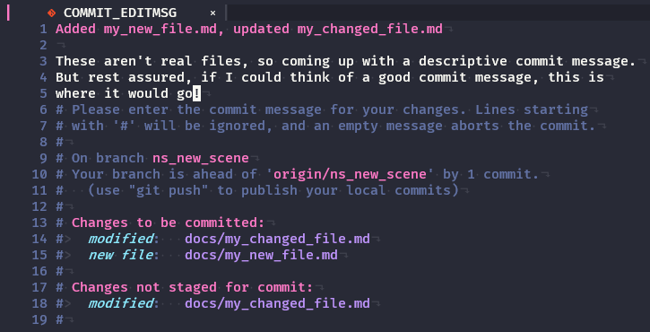

Or if you have a fairly short commit message, you can type `git commit -m <commit_message>`:  

```PowerShell
> git commit -m "Added a new pretend file for demonstration"
[ns_new_scene 080cdd4] Added a new pretend file for demonstration
 1 file changed, 1 insertion(+)
```

However you choose, it's best practice to have an empty line between your "title"/"summary" and "description".

This requires you to have staged changes first!

*Note: If you run `git commit` and you find yourself in a text editor you don't know how to use, `git` probably opened `vi`. To get out of it hit `ESC`, then `:q!`. This will quit `vi` wihtout saving any changes. See the section below to change the text editor `git` uses.*

If you wish to [add a Co-Author to a commit](https://docs.github.com/en/pull-requests/committing-changes-to-your-project/creating-and-editing-commits/creating-a-commit-with-multiple-authors), you can do so by adding thier name and email to the bottom of the commit message, preceded by the text `Co-authored-by:`:

```PowerShell
> git commit -m "Adding a test commit with multiple authors.
>
> Co-authored-by: NAME <NAME@EXAMPLE.COM>
> Co-authored-by: ANOTHER-NAME <ANOTHER-NAME@EXAMPLE.COM>"
```

#### Changing `git`'s Default Text Editor

To change the text editor that `git` uses to something a little friendlier for anyone who doesn't [grok vi](https://stackoverflow.com/a/1220118/3001761), you can simply [configure the core.editor for git](https://git-scm.com/book/en/v2/Appendix-C%3A-Git-Commands-Setup-and-Config#ch_core_editor). That link contains an exhaustive list of editors to use with `git`, so you should find one you're familliar with.

For exmaple, to use VSCode type `git config --global core.editor "code --wait"`.

*Note that this is a **global** change!* To make the change for this repo only, omit the `--global` tag: `git config core.editor "code --wait"`.

### Committing a Change with GitHub Desktop

At the bottom of the sidebar in GitHub Desktop, there is a space to fill out a "Summary" and "Description" for the commit:  


Here you can type in a "Summary" which is required, and a longer description if it is needed.

If you worked on changes offline with someone else, you can also add Co-Authors to the commit. Click the highlighted icon and type their GitHub username:  
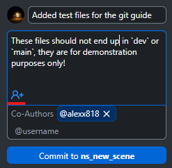.

Once you are ready, simply click the "Commit" button below the description box.

### Commiting a Change with VSCode

In the source control tab of VSCode, there is a box to enter your commit messages into. You can enter multiple lines, and it's usually best practice to have an empty line between "title"/"summary" and "description":  
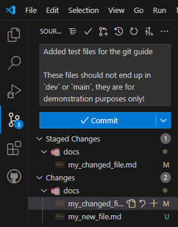

If you wish to add Co-Authors to a commit, you can add a new line with the text `Co-authored-by:` to the end of the commit message, and then type their name and email:  

